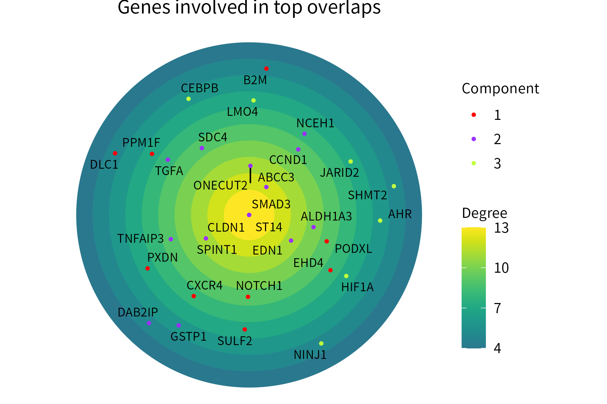
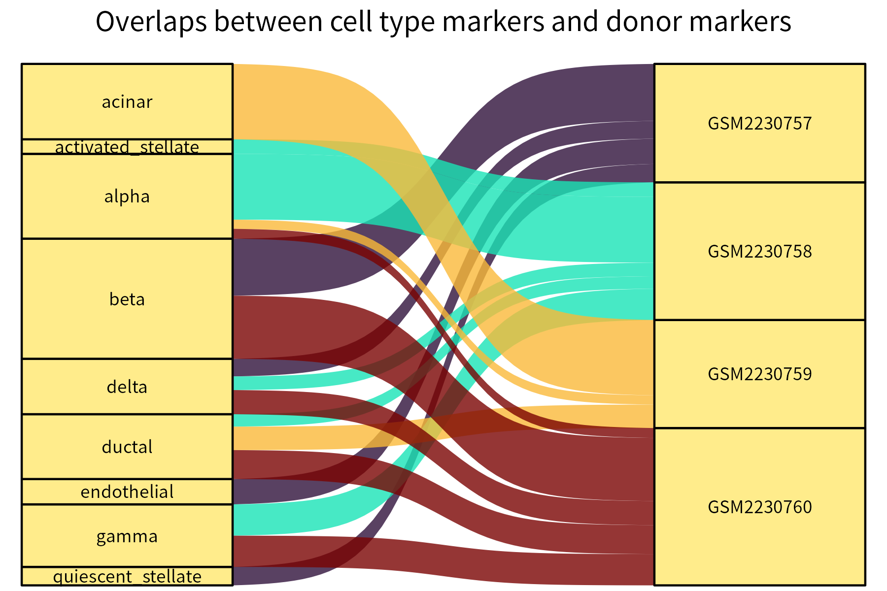
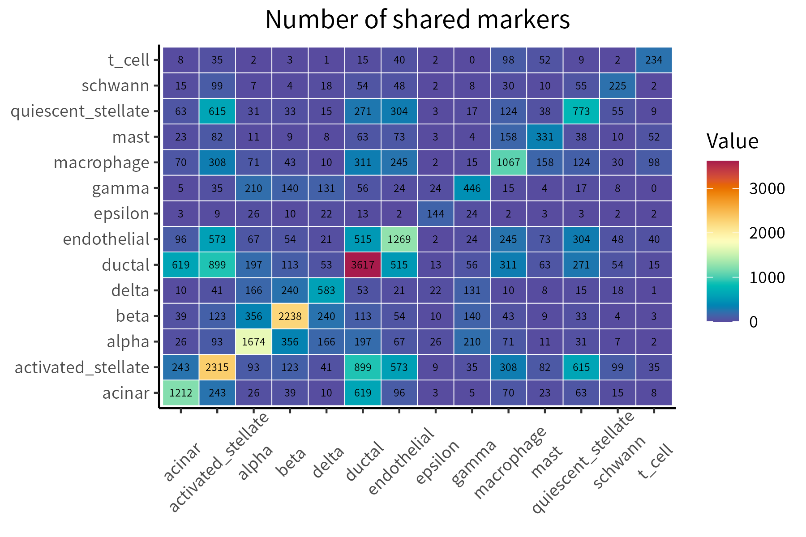

# henna
`henna` provides nine versatile visualization utilities. They are designed with 
scRNA-seq data analysis in mind, but can be used for a variety of other 
applications as well.

## Installation

To install `henna`, run the following R code:

```
if (!require("BiocManager", quietly = TRUE))
    install.packages("BiocManager")
    
BiocManager::install("andrei-stoica26/henna")
```
## Visualization tools

- `classPlot`: Create a bar plot for a set of items grouped by class and orders
the items and classes.


- `correlationPlot`: Plot a correlation matrix.


- `densityPlot`: Create a density plot for a set of points, optionally displaying
segements between each point and its nearest neighbor.


- `hullPlot`: Plot the convex hull of a set of points. Optionally, divide the
points into 2 or 4 classes of different colors by drawing a vertical and/or
a horizontal line that intersects the hull.


- `networkPlot`: Plot a graph using different colors for nodes that are part of 
different connected components.


- `radialPlot`: Plot integer-valued points over concentric circles, with points 
located more centrally representing higher values.



- `rankPlot`: Aggregate multiple ranks available for a group of items in a single
plot.


- `riverPlot`: Generate an alluvial plot for a data frame with two categorical 
columns and a weights column.



- `tilePlot`: Plot a numeric matrix.


